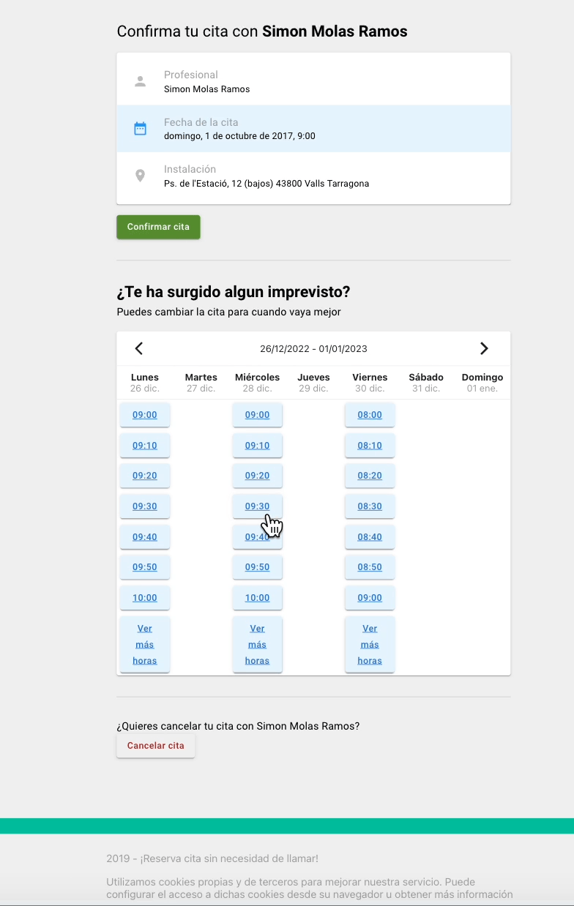

# scheduling-ui

A reschedule calendar.

## Installation
Run `npm i`

## Deploy locally
Run `npm start`

## Tests
Run `npm run test`

## Stack
 - Redux-saga for state management
 - Material-UI as component library
 - CRA as boilerplate
 - LocalStorage for data persistancy
 - Component-based routing depending on state
